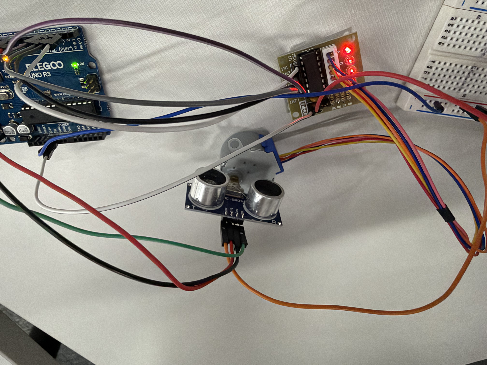

# 2D Ultrasonic Scanner

## Project Goal

For this project, my goal was to build a simple spinning 2D scanner as the minimum testable prototype for a more advanced 3D scanner.

The basic idea is to rotate an ultrasonic sensor and measure the distance to objects at different angles. These measurements can eventually be used to create a visual representation of the scanned area.
Components
Arduino Uno

HC-SR04 ultrasonic sensor

XJS-2210E4 stepper motor

ULN2003 motor driver

Breadboard

Jumper wires
Building the Scanner
I started by connecting the HC-SR04 ultrasonic sensor to the Arduino.
HC-SR04
Arduino Uno
VCC

5V

GND

GND

TRIG

Pin 9

ECHO

Pin 10

The stepper motor was connected to the ULN2003 driver board. The four input pins on the driver were connected to Arduino pins 2, 3, 4, and 5.

I then attached the ultrasonic sensor to the rotating part of the stepper motor. This allowed the sensor to rotate while measuring the distance in different directions.
Learning the Code
I did not write the code completely from scratch. Since I am still learning Arduino programming, I used Arduino examples and resources from the internet to understand how the different parts worked.

I especially used the Arduino Stepper library examples, including the stepper_oneStepAtATime example, to learn how to control the stepper motor one step at a time.

I then adapted the examples to work with my own hardware and added code for the HC-SR04 ultrasonic sensor.

The basic process of my program is:

Move the stepper motor

        ↓

Measure distance with HC-SR04

        ↓

Record the angle and distance

        ↓

Move again

        ↓

Repeat

One important part I learned was how the ultrasonic sensor calculates distance. The Arduino measures how long the sound wave takes to travel to an object and return.

Distance = Time × Speed of Sound ÷ 2

The / 2 is necessary because the sound travels to the object and then back to the sensor.
Arduino Code
This is the code I used for the prototype:

#include <Stepper.h>

const int stepsPerRevolution = 2048;

// ULN2003: IN1, IN3, IN2, IN4 order for Stepper library

Stepper motor(stepsPerRevolution, 2, 4, 3, 5);

const int trigPin = 9;

const int echoPin = 10;

void setup() {

  Serial.begin(9600);

  pinMode(trigPin, OUTPUT);

  pinMode(echoPin, INPUT);

  motor.setSpeed(10);

  Serial.println("Angle,Distance(cm)");

}

float getDistance() {

  digitalWrite(trigPin, LOW);

  delayMicroseconds(2);

  digitalWrite(trigPin, HIGH);

  delayMicroseconds(10);

  digitalWrite(trigPin, LOW);

  long duration = pulseIn(echoPin, HIGH, 30000);

  if (duration == 0) {

    return -1;

  }

  float distance = duration * 0.0343 / 2;

  return distance;

}

void loop() {

  // Scan from 0 to 180 degrees

  for (int angle = 0; angle <= 180; angle += 5) {

    int steps = (int)(2048.0 * 5.0 / 360.0);

    motor.step(steps);

    delay(100);

    float distance = getDistance();

    Serial.print(angle);

    Serial.print(",");

    Serial.println(distance);

    delay(100);

  }

  // Return to starting position

  for (int angle = 180; angle > 0; angle -= 5) {

    int steps = (int)(2048.0 * 5.0 / 360.0);

    motor.step(-steps);

    delay(5);

  }

  delay(1000);

}
Testing
After uploading the code, I opened the Serial Monitor at 9600 baud.

The Arduino printed the angle and distance measurements in this format:

Angle,Distance(cm)

0,42.3

5,41.8

10,40.5

15,38.9

20,37.4

<video width="320" height="240" controls loop="" muted="" autoplay="">
    <source src="https://github.com/JonchiLI/JonchiLI.github.io/raw/refs/heads/main/images/9cfddf7b29dd5f77975835b4af233382.mp4" />
</video>

This showed that the motor and ultrasonic sensor were working together. The motor moved the sensor to different positions, and the HC-SR04 recorded the distance at each position.
What I Learned
The biggest thing I learned from this prototype was how multiple hardware components can work together as one system.

I learned:

How to control a stepper motor with an Arduino and ULN2003 driver

How an HC-SR04 ultrasonic sensor measures distance

How to use digitalWrite() to control the sensor

Using existing code was also part of my learning process. I could not have written the entire program from scratch yet, so I used online documentation and examples, understood what the code was doing, and modified it for my own scanner.
Next Steps
This prototype is the minimum testable version of my larger 3D scanner project.

The next step is to figure out how to turn the distance measurements into a visual 2D scan. After that, I want to add another axis of movement so the sensor can measure at different heights.

The eventual goal is to combine the horizontal and vertical measurements to create a 3D point cloud.
