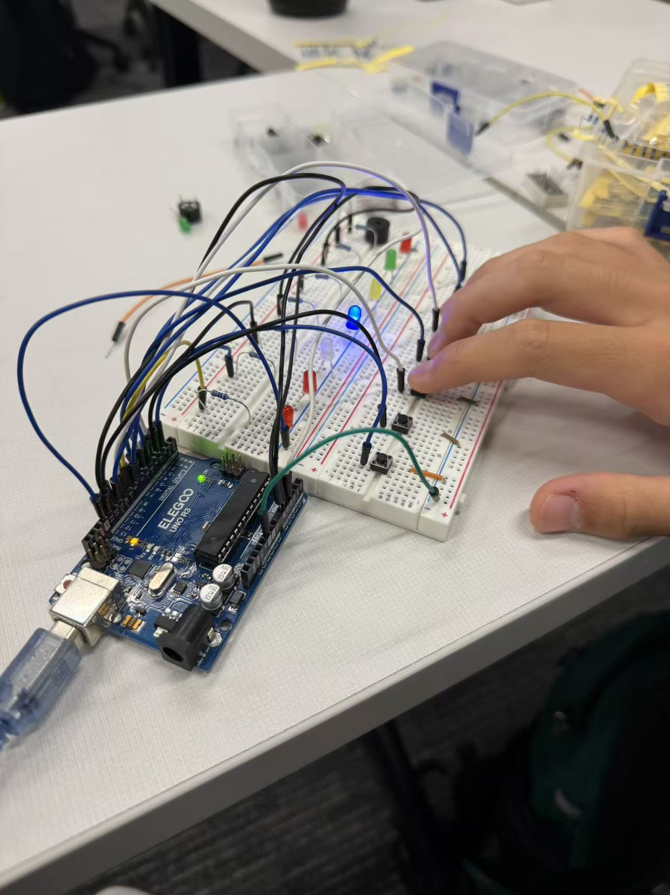
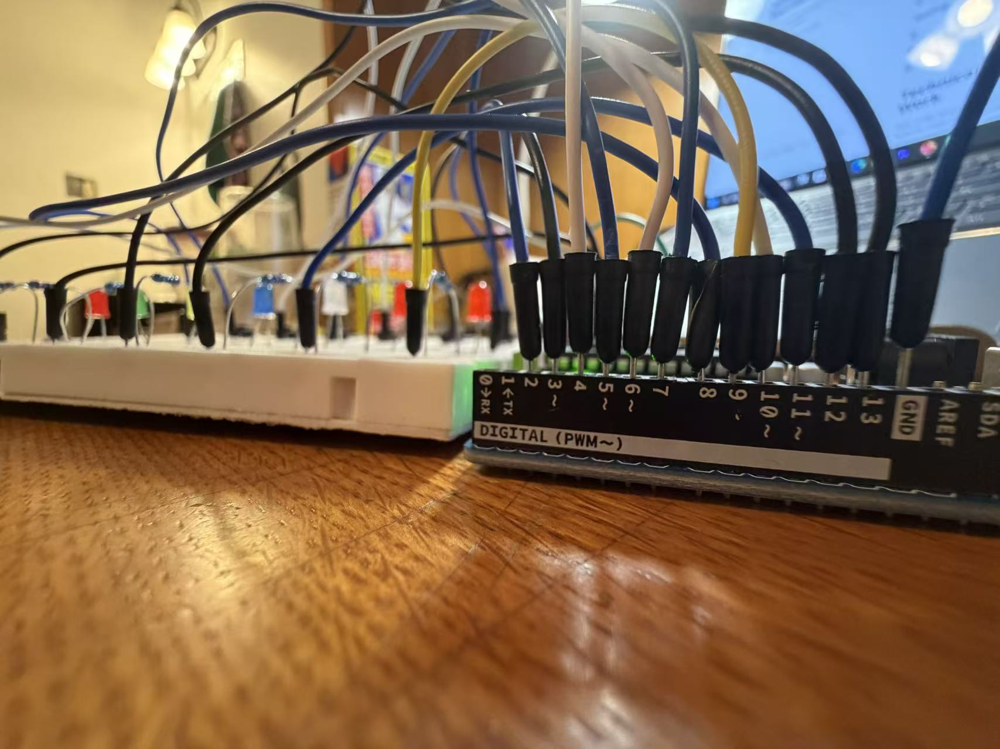
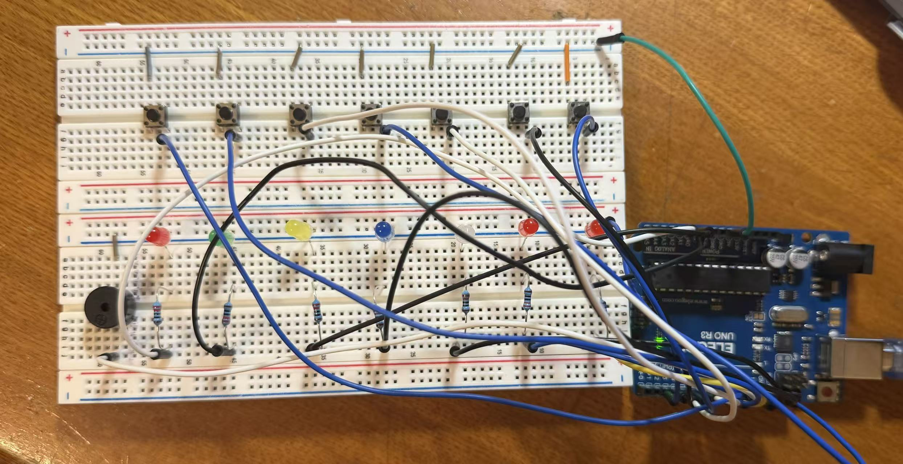

# Arduino Piano

## Overview

For my Unit 1 Summative Project, I created an interactive Arduino piano using push buttons, LEDs, and a piezo buzzer. Each button represents a different musical note. When I press a button, the Arduino detects the input, turns on the matching LED, and plays the corresponding note through the buzzer.

I chose this project because I wanted to combine programming with a physical device that I could actually interact with. Instead of only seeing the result of my code on a computer, I wanted to create something where my actions directly controlled the Arduino.

---

## 1. Existing Skills and Interests

Before starting this project, I already had some experience with basic Arduino programming and circuits. I knew how to connect simple components and use basic Arduino functions, but I wanted to become more comfortable working with multiple inputs and outputs at the same time.

I chose the piano because I also want to make something more interactive. A piano was a good project because pressing a button immediately creates both a visual and audio response, which allows me to combine programming, electronics, and music into one device.

---

## 2. New Component

The main new component I worked with was the **piezo buzzer**.

A piezo buzzer can produce sound when an electrical signal is sent to it. The frequency of the signal determines the pitch. A lower frequency produces a lower sound, while a higher frequency produces a higher sound.

I used different frequencies for the seven notes in my piano:

| Note | Frequency |
| ---- | --------: |
| C    |    262 Hz |
| D    |    294 Hz |
| E    |    330 Hz |
| F    |    349 Hz |
| G    |    392 Hz |
| A    |    440 Hz |
| B    |    494 Hz |

I used the Arduino Project Hub tutorial **"Arduino Piano with Push Buttons, Buzzer and LED Indicators"** as my starting point.

The tutorial helped me understand the basic circuit and gave me an example of how the buttons, LEDs, and buzzer could work together.

---

## 3. What I Tried

### Building the Circuit

I started by building the circuit with seven push buttons, seven LEDs, and a buzzer.

Each button was connected to a different Arduino input pin. Each LED was connected to its own output pin, and the buzzer was connected to another output pin.

The buttons use the Arduino's internal pull-up resistors. This means that the Arduino normally reads the button as HIGH. When the button is pressed, it connects the input to ground, so the Arduino reads LOW.

### Testing

I tested the project in smaller parts before trying everything at once.

First, I checked that the Arduino could detect the buttons. Then I checked that the LEDs could turn on and off. Finally, I tested the buzzer.

Testing each part separately made it easier to find problems because I could focus on one part of the circuit at a time.



### A Problem I Had

One thing I had trouble understanding was why the button was being detected as LOW when I pressed it.

At first, I expected a pressed button to produce a HIGH signal. After looking at the `INPUT_PULLUP` setup, I realized that the button works differently because the Arduino's internal pull-up resistor keeps the input HIGH until the button connects it to ground.

This meant:

* Not pressed = HIGH
* Pressed = LOW

Understanding this helped me understand both the circuit and the code better.

Another problem I had to watch for was making sure that each button matched the correct LED and note. Since there were seven of each, the connections had to stay organized.



---

## 4. Final Project

My final project is a seven-note Arduino piano.

The seven buttons correspond to the seven notes from C to B. When I press a button, the Arduino detects which button was pressed and then activates the matching LED and buzzer.

The result is a physical instrument controlled by an Arduino.

### Circuit



### Testing


### Final Result


---

# Technical Tidbit: How the Buttons Work

One of the most interesting technical parts of this project was learning how Arduino reads a push button.

The buttons use:

```cpp
pinMode(buttonPins[i], INPUT_PULLUP);
```

`INPUT_PULLUP` activates a resistor inside the Arduino that keeps the input at HIGH when the button is not pressed.

The button is connected between the Arduino input pin and GND. When the button is pressed, the input becomes connected to ground.

This creates the following system:

```text
Button not pressed → HIGH
Button pressed     → LOW
```

The Arduino checks the button using `digitalRead()`.

For example:

```cpp
digitalRead(buttonPins[i]) == LOW
```

means that the Arduino is checking whether the button is currently pressed.

This was important for my project because the Arduino needed to know exactly which of the seven buttons the user was pressing before it could choose the correct LED and note.

---

# Peer Support


---

# Use-Case Reflection

My Arduino piano could be used as a simple introduction to electronics and programming for someone who has never worked with an Arduino before.

For example, it could be used in a classroom demonstration to show how physical inputs can control different outputs. A student could press a button and immediately see and hear the result.

If I continued developing the project, I could add more notes, more buttons, or a display. I could also create a second mode where the Arduino plays a sequence of notes and the user has to repeat the sequence. This would turn the piano into a simple memory game.

The skill from this unit that I relied on the most was understanding how digital inputs and outputs work together. The buttons provide information to the Arduino, and the Arduino uses that information to control the LEDs and buzzer.

---

# What I Learned

This project helped me understand that an Arduino project is not just about writing code. The physical circuit and the code have to match each other.

I learned how to:

* Build a circuit with multiple components
* Use push buttons as digital inputs
* Use LEDs as digital outputs
* Use `INPUT_PULLUP`
* Use a piezo buzzer to produce different frequencies
* Connect arrays in code to physical components
* Troubleshoot wiring and code problems
* Test individual components before combining them
* Use a tutorial as a starting point while understanding how the project works

The biggest thing I learned was how inputs and outputs can work together to create an interactive device. The Arduino receives information from the buttons and uses that information to control the LEDs and buzzer.

---

# Reflection

Overall, this project gave me a better understanding of how programming and electronics work together.

The most challenging part was troubleshooting the buttons and making sure that each button, LED, and note matched correctly. Once I understood how the pins and arrays were connected, the project became much easier to manage.

If I continued working on this project, I would add a second mode, such as a memory game where the Arduino plays a sequence of notes and the user tries to repeat it. I could also add a display or more buttons to make the project more like a complete instrument.

This project showed me that even a relatively simple Arduino circuit can become much more interesting when different inputs and outputs are combined.

